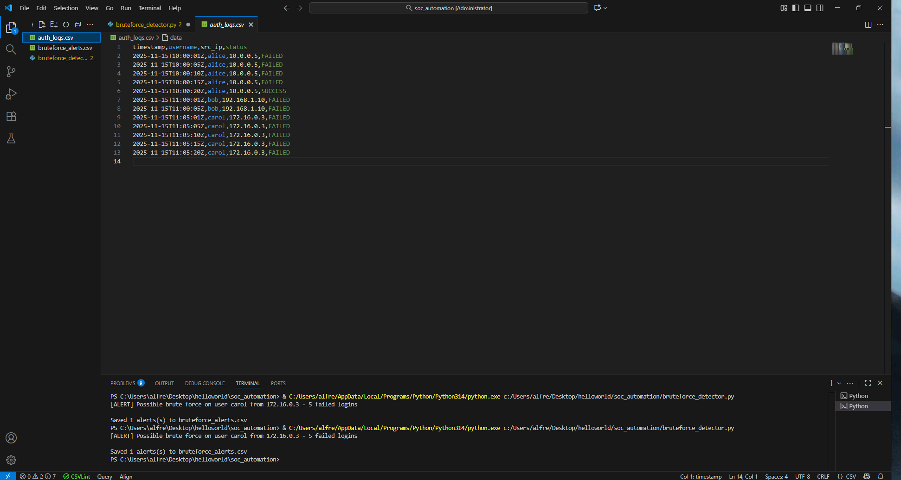
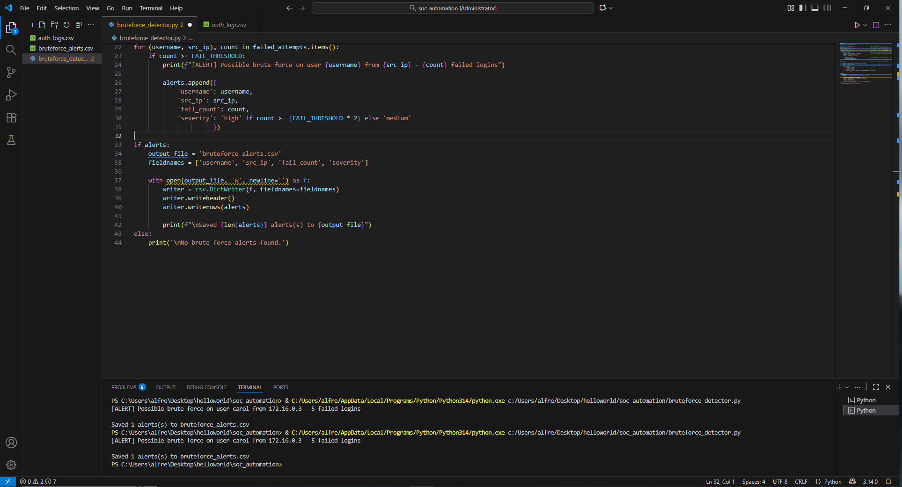
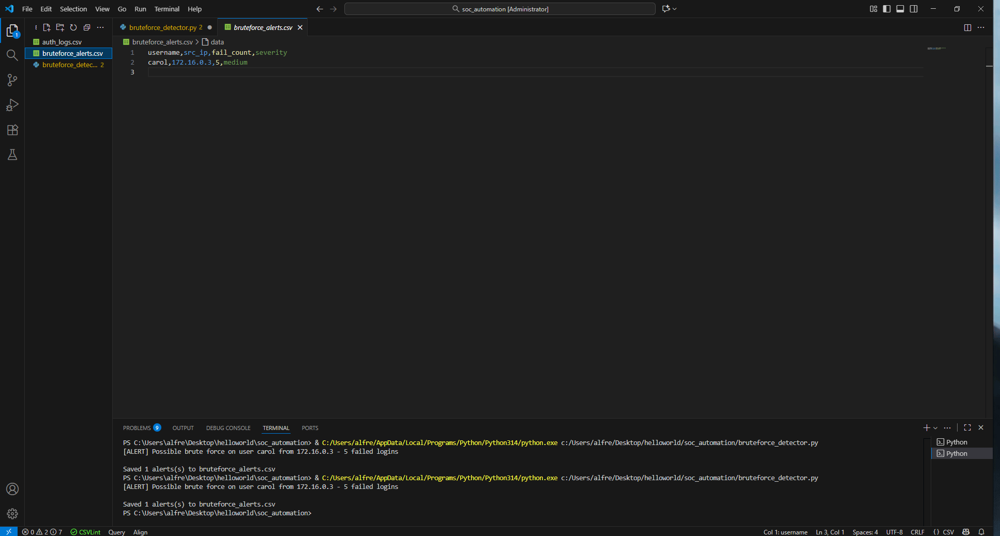

# SSH Brute Force Detection & Alert Automation

## 🎯 Project Overview

This Python-based security automation tool monitors authentication logs for SSH brute force attacks, automatically detects suspicious activity based on configurable thresholds, and generates severity-based alerts for SOC analysts. The tool processes authentication events, tracks failed login attempts per user/IP combination, and exports actionable alerts to CSV format for incident response workflows.


## 📸 Screenshots

### Authentication Logs Input


### Detection Script #1


### Detection Script #2


### Alert CSV Export



## 🔍 Use Case

In production SOC environments, analysts face thousands of authentication events daily. Manual review is time-intensive and prone to human error. This automation:
- **Reduces alert fatigue** by filtering noise and surfacing only high-confidence threats
- **Accelerates incident response** through automatic severity classification
- **Enables proactive threat hunting** by tracking failed authentication patterns
- **Provides audit trails** with structured CSV output for compliance reporting

## 🛠️ Technical Stack

- **Language:** Python 3.x
- **Libraries:** 
  - `csv` - Authentication log parsing and alert export
  - `collections.defaultdict` - Efficient failed attempt tracking per user/IP pair

## 📋 Features

✅ **Automated Log Parsing** - Ingests CSV-formatted authentication logs  
✅ **Brute Force Detection** - Identifies repeated failed login attempts from unique IP addresses  
✅ **Configurable Threshold** - Customizable alert trigger (default: 5 failed attempts)  
✅ **Severity Classification** - Assigns "high" (10+ failures) or "medium" (5-9 failures) risk levels  
✅ **CSV Alert Export** - Generates actionable alerts with username, source IP, failure count, and severity  
✅ **Scalable Design** - Handles large log volumes with dictionary-based tracking  

## 🚀 How It Works

### Detection Logic

1. **Log Ingestion**: Reads `auth_logs.csv` containing authentication events
2. **Failed Login Tracking**: Monitors only `FAILED` status events, ignoring successful authentications
3. **Aggregation**: Groups failed attempts by `(username, source_IP)` pairs using `defaultdict`
4. **Threshold Comparison**: Flags users/IPs exceeding 5 failed attempts (configurable)
5. **Severity Assignment**: 
   - **High**: ≥10 failed attempts (indicates aggressive brute force)
   - **Medium**: 5-9 failed attempts (potential reconnaissance or weak attack)
6. **Alert Generation**: Exports findings to `bruteforce_alerts.csv` for analyst review

### Sample Detection

**Input Log (`auth_logs.csv`):**
```
timestamp,username,src_ip,status
2025-11-15T10:08:01Z,alice,10.0.0.5,FAILED
2025-11-15T10:08:05Z,alice,10.0.0.5,SUCCESS
2025-11-15T11:05:01Z,carol,172.16.0.3,FAILED
2025-11-15T11:05:05Z,carol,172.16.0.3,FAILED
2025-11-15T11:05:10Z,carol,172.16.0.3,FAILED
2025-11-15T11:05:15Z,carol,172.16.0.3,FAILED
2025-11-15T11:05:20Z,carol,172.16.0.3,FAILED
```

**Output Alert (`bruteforce_alerts.csv`):**
```
username,src_ip,fail_count,severity
carol,172.16.0.3,5,medium
```

## 📂 Project Structure

```
soc_automation/
│
├── auth_logs.csv              # Input: Authentication event logs
├── bruteforce_detector.py     # Main detection script
└── bruteforce_alerts.csv      # Output: Generated security alerts
```


## 🧠 Code Breakdown

### Line-by-Line Explanation

```python
import csv
from collections import defaultdict
```
**What it does:** Imports required Python modules  
**How it works:**
- `import csv` - Loads the CSV module for reading/writing comma-separated value files
- `from collections import defaultdict` - Imports defaultdict class from collections module for automatic dictionary value initialization

---

```python
LOG_FILE: str = "auth_logs.csv"
```
**What it does:** Declares a constant variable `LOG_FILE` of type `str` (string) and assigns it the value `"auth_logs.csv"`  
**How it works:** Defines the input file path as a string variable. The type hint `: str` indicates this variable should contain string data  
**Why needed:** Centralizes the file path in one location for easy configuration changes

---

```python
FAIL_THRESHOLD: int = 5
```
**What it does:** Declares a constant variable `FAIL_THRESHOLD` of type `int` (integer) and assigns it the value `5`  
**How it works:** Sets the minimum number of failed login attempts required to trigger an alert  
**Why needed:** Provides configurable detection sensitivity - lower values catch more attempts but may increase false positives

---

```python
failed_attempts = defaultdict(int)
```
**What it does:** Creates a variable `failed_attempts` and assigns it a `defaultdict` object with `int` as the default factory  
**How it works:** `defaultdict(int)` creates a dictionary that automatically initializes new keys with value `0` (the default value for `int()`)  
**Why needed:** Eliminates the need to check if a key exists before incrementing - accessing a non-existent key returns `0` instead of raising a `KeyError`

---

```python
with open(LOG_FILE, "r") as f:
```
**What it does:** Opens the file specified in `LOG_FILE` in read mode (`"r"`) and assigns the file object to variable `f`  
**How it works:** The `with` statement creates a context manager that automatically closes the file when the block exits, even if an error occurs  
**Why needed:** Ensures proper file handling and automatic resource cleanup

---

```python
    reader = csv.DictReader(f)
```
**What it does:** Creates a `csv.DictReader` object from file object `f` and assigns it to variable `reader`  
**How it works:** `DictReader` reads the CSV file and converts each row into a dictionary where keys are column headers and values are cell contents  
**Why needed:** Allows accessing CSV data by column name (e.g., `row['username']`) instead of numeric index

---

```python
    for row in reader:
```
**What it does:** Iterates through each row in the `reader` object, assigning each dictionary to variable `row`  
**How it works:** For loop executes once per CSV row, with `row` containing a dictionary of that row's data  
**Why needed:** Processes each authentication event sequentially

---

```python
        status = row.get('status', '').upper()
```
**What it does:** Retrieves the value of key `'status'` from dictionary `row`, defaults to empty string if key doesn't exist, converts result to uppercase, and assigns to variable `status`  
**How it works:** 
- `row.get('status', '')` - Dictionary method that returns value for key `'status'`, or `''` if key is missing
- `.upper()` - String method that converts all characters to uppercase
**Why needed:** Safely extracts status field and normalizes case for consistent comparison

---

```python
        username = row.get('username', '')
```
**What it does:** Retrieves the value of key `'username'` from dictionary `row`, defaults to empty string if key doesn't exist, and assigns to variable `username`  
**How it works:** Uses dictionary `.get()` method with default value to prevent KeyError  
**Why needed:** Extracts the username field from the current log entry

---

```python
        src_ip = row.get('src_ip', '')
```
**What it does:** Retrieves the value of key `'src_ip'` from dictionary `row`, defaults to empty string if key doesn't exist, and assigns to variable `src_ip`  
**How it works:** Uses dictionary `.get()` method with default value to prevent KeyError  
**Why needed:** Extracts the source IP address field from the current log entry

---

```python
        if status == 'FAILED':
```
**What it does:** Conditional statement that checks if variable `status` equals the string `'FAILED'`  
**How it works:** Uses equality operator `==` to compare strings. Executes indented code block only if condition is `True`  
**Why needed:** Filters events to process only failed authentication attempts, ignoring successful logins

---

```python
            key = (username, src_ip)
```
**What it does:** Creates a tuple containing `username` and `src_ip`, assigns it to variable `key`  
**How it works:** Parentheses `()` create an immutable tuple data structure  
**Why needed:** Combines username and IP into a single composite key for tracking per-user, per-IP failed attempts

---

```python
            failed_attempts[key] += 1
```
**What it does:** Increments the value associated with `key` in the `failed_attempts` dictionary by 1  
**How it works:** 
- `failed_attempts[key]` - Accesses dictionary value for `key` (returns `0` if new key due to defaultdict)
- `+= 1` - Shorthand for `failed_attempts[key] = failed_attempts[key] + 1`
**Why needed:** Counts total failed attempts for each username/IP combination

---

```python
alerts = []
```
**What it does:** Creates an empty list and assigns it to variable `alerts`  
**How it works:** Square brackets `[]` create a new list object in Python  
**Why needed:** Initializes a container to store alert dictionaries for later export

---

```python
for (username, src_ip), count in failed_attempts.items():
```
**What it does:** Iterates through key-value pairs in `failed_attempts` dictionary, unpacking tuple key into `username` and `src_ip`, and assigning value to `count`  
**How it works:**
- `.items()` - Dictionary method that returns iterable of (key, value) tuples
- `(username, src_ip), count` - Tuple unpacking that extracts tuple elements into separate variables
**Why needed:** Processes each tracked username/IP pair and their failure count

---

```python
    if count >= FAIL_THRESHOLD:
```
**What it does:** Conditional statement that checks if variable `count` is greater than or equal to `FAIL_THRESHOLD`  
**How it works:** Uses comparison operator `>=` to compare integers. Returns `True` if count meets or exceeds threshold  
**Why needed:** Filters to only process username/IP pairs that exceed the suspicious activity threshold

---

```python
        print(f"[ALERT] Possible brute force on user {username} from {src_ip} - {count} failed logins")
```
**What it does:** Outputs formatted string to console using f-string interpolation  
**How it works:**
- `f"..."` - F-string prefix allows embedding variables using `{variable}` syntax
- `{username}`, `{src_ip}`, `{count}` - Placeholders replaced with variable values
- `print()` - Built-in function that writes to standard output
**Why needed:** Provides real-time alert notification to console for immediate analyst awareness

---

```python
        alerts.append({
            'username': username,
            'src_ip': src_ip,
            'fail_count': count,
            'severity': 'high' if count >= (FAIL_THRESHOLD * 2) else 'medium'
        })
```
**What it does:** Creates a dictionary with alert data and appends it to the `alerts` list  
**How it works:**
- `{}` - Creates a dictionary with key-value pairs
- Ternary operator: `'high' if condition else 'medium'` - Assigns `'high'` if condition is `True`, otherwise `'medium'`
- `FAIL_THRESHOLD * 2` - Multiplies threshold by 2 (e.g., `5 * 2 = 10`)
- `.append()` - List method that adds element to end of list
**Why needed:** Stores structured alert data for CSV export, with dynamic severity classification

---

```python
if alerts:
```
**What it does:** Conditional statement that checks if `alerts` list contains any elements  
**How it works:** Empty lists evaluate to `False` in boolean context, non-empty lists evaluate to `True`  
**Why needed:** Only executes CSV export code if alerts were generated, preventing creation of empty files

---

```python
    output_file = 'bruteforce_alerts.csv'
```
**What it does:** Creates a variable `output_file` of type string and assigns it the value `'bruteforce_alerts.csv'`  
**How it works:** String literal assignment using single quotes  
**Why needed:** Defines the output filename for the alert CSV file

---

```python
    fieldnames = ['username', 'src_ip', 'fail_count', 'severity']
```
**What it does:** Creates a list containing four string elements and assigns it to variable `fieldnames`  
**How it works:** Square brackets `[]` create a list, comma-separated strings are list elements  
**Why needed:** Defines CSV column headers and order for DictWriter

---

```python
    with open(output_file, 'w', newline='') as f:
```
**What it does:** Opens file specified in `output_file` in write mode (`'w'`), with `newline=''` parameter, assigns file object to variable `f`  
**How it works:**
- `'w'` mode - Creates new file or overwrites existing file
- `newline=''` - Prevents extra blank lines in CSV on Windows (required by csv module)
- `with` statement - Context manager for automatic file closing
**Why needed:** Prepares file for writing CSV data with proper line ending handling

---

```python
        writer = csv.DictWriter(f, fieldnames=fieldnames)
```
**What it does:** Creates a `csv.DictWriter` object with file object `f` and column names from `fieldnames`, assigns to variable `writer`  
**How it works:** `DictWriter` constructor takes file object and fieldnames list, returns writer object that maps dictionary keys to CSV columns  
**Why needed:** Enables writing dictionary objects as CSV rows with specified column order

---

```python
        writer.writeheader()
```
**What it does:** Calls `writeheader()` method on `writer` object to write column names as first CSV row  
**How it works:** Method uses `fieldnames` list to create header row automatically  
**Why needed:** Creates CSV header row so output file has labeled columns

---

```python
        writer.writerows(alerts)
```
**What it does:** Calls `writerows()` method on `writer` object, passing `alerts` list as argument  
**How it works:** Iterates through `alerts` list and writes each dictionary as a CSV row, mapping dictionary keys to columns  
**Why needed:** Batch-writes all alerts to CSV file efficiently

---

```python
    print(f"\nSaved {len(alerts)} alert(s) to {output_file}")
```
**What it does:** Outputs formatted string to console showing number of alerts saved and output filename  
**How it works:**
- `\n` - Escape sequence that inserts newline character
- `len(alerts)` - Built-in function that returns integer count of list elements
- F-string interpolation embeds variable values
**Why needed:** Confirms successful file save operation with alert count

---

```python
else:
```
**What it does:** Defines the else clause for the `if alerts:` conditional  
**How it works:** Executes indented code block only when the `if` condition is `False` (empty alerts list)  
**Why needed:** Provides alternative code path when no alerts are detected

---

```python
    print('\nNo brute-force alerts found.')
```
**What it does:** Outputs string to console indicating no threats detected  
**How it works:** `print()` function with string literal argument, `\n` adds newline before message  
**Why needed:** Informs analyst that script completed successfully but found no suspicious activity

## 🎓 Learning Outcomes

This project demonstrates:
- **Log Analysis Automation** - Parsing structured security logs programmatically
- **Threat Detection Logic** - Implementing SIEM-like correlation rules in Python
- **Data Aggregation** - Using dictionaries for efficient event grouping
- **Incident Response Workflows** - Generating actionable alerts with severity classification
- **Production-Ready Code** - Error handling, configurability, and clear output formatting


## 📈 Future Enhancements

- [ ] **Time-Based Analysis**: Detect concentrated attacks within specific time windows
- [ ] **IP Reputation Integration**: Cross-reference source IPs with threat intelligence feeds
- [ ] **Automated Blocking**: Generate firewall rules or SIEM actions for confirmed threats
- [ ] **Dashboard Integration**: Export alerts to Splunk/Elastic via API
- [ ] **Machine Learning**: Anomaly detection for sophisticated, low-and-slow attacks

